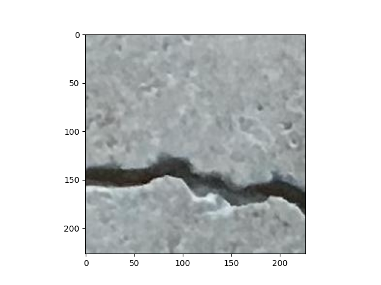
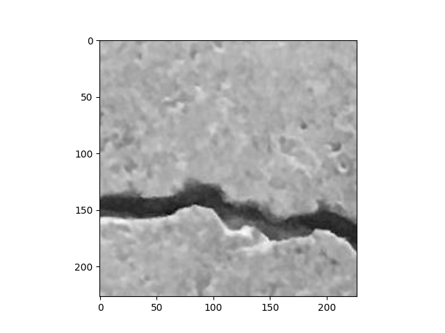
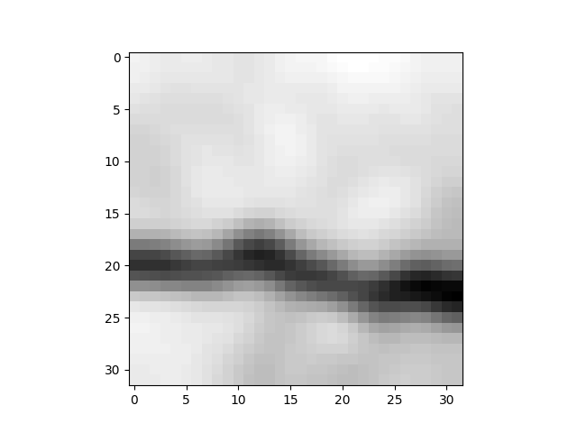
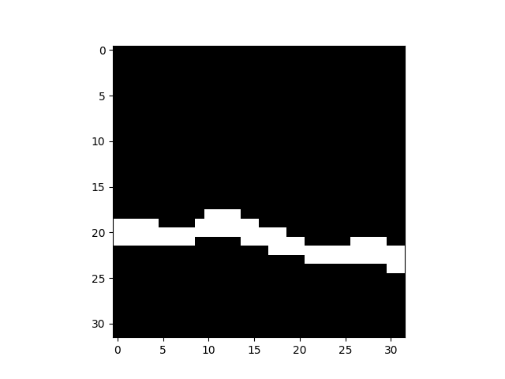
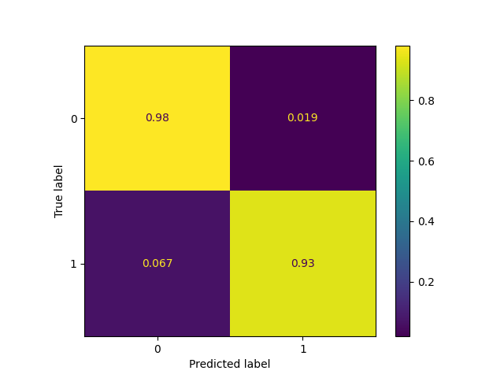

## Task
### Goal
Develop an approach for defect (cracks) detection to distinguish photos with and without defects.

### Dataset
Dataset contains unlabeled train data (15000 images) and two types of labeled test datasets:  
    • balanced (1000 normal images, 1000 anomaly images)  
    • unbalanced (970 normal images, 30 anomaly images)  
Images have 227x227 resolution with RGB channels.

### You need
Use the train dataset for developing a deep-learning approach. Evaluate the approaches using the proper test datasets. Calculate metrics, visualize results. 

### Output
Repository with code and report in separate document (google doc or doc in markdown format) with results and conclusions, model weights if any.

## Solution

I saw two ways for solving this problem.  
• using semi-supervised learning  
• using unsupervised learning  

The first approach requires a partial labeling of the training dataset. I would have to do it manually, so I wouldn't be 100% sure that all the labels are correct. On the other hand, the second approach is more challenging for deep learning networks.

In the end, I choose an unsupervised approach.

### Pre-processing
Quality of data and the useful information that can be derived from it directly affects the ability of our model to learn. 
Therefore, it is extremely important to preprocess our data before feeding it into our model.

First let's take a look at original image:

Image consists of 224x224 pixels with RGB channels.
Colors of these pixels are not too meaningful, so I converted it to greyscale (it helps to reduce channels and complexity of model):

In the next step I resized image to 32x32 pixels, crack is still visible, but it will reduce input size:

Another used transformation is Gaussian Blur, which allows remove the noise while protecting the original image:

In the end, I used Adaptive Threshold to clearly separate crack area:

The images prepared in this way will be used in the network.
### Autoencoder

My idea to solve this problem is to cluster image representations.
Current image representation consists of 32x32 pixels, which gives 1024 features per image.
Such high dimensional data is hard to cluster, 
so I used autoencoder deep neural network to compress the image representation.  

In this repository, I added [checkpoint file](checkpoint.ckpt), which automatically loads trained weights.  

In the picture below, we can see how trained autoencoder reconstruct cracks (from test data) based on a vector with 128 features.

Such vector represents most important image features and thanks to the reduced size clustering is possible.

### Clustering

For clustering, I used Gaussian Mixture. This model is a probabilistic model that assumes all the data points are generated from a mixture of a finite number of Gaussian distributions with unknown parameters.
It considers each cluster as a different Gaussian distribution. Then it will tell, based on probability, out of which distribution that data point came out.

As the input for clustering, I've used encoded training images (128-length vectors).
After clustering, I assigned correct labels to two created groups.

### Results
For testing purposes, I choose an imbalanced dataset because it better reflects real-world data.

Classes are imbalanced, so I can't use accuracy. 
The results are presented below in table with precision, recall and F1 score.

| Precision | Recall | F1   |
|-----------|--------|------|
| 0.98      | 0.98   | 0.98 |

In conclusion, I trained an unsupervised model which allows distinguishing photos with high efficiency.
